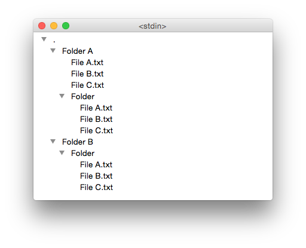

# tree-view

Easily navigate a text file with the structure of the output of `find`.

```console
$ find . | head
.
./.localized
./Accounts
./Accounts/Accounts3.sqlite
./Accounts/Accounts3.sqlite-shm
./Accounts/Accounts3.sqlite-wal
./Application Scripts
./Application Scripts/2BUA8C4S2C.com.agilebits.onepassword-osx-helper
./Application Scripts/2BUA8C4S2C.com.agilebits.onepassword-osx-helper/1Password_Autosubmit.scpt
./Application Support
```

Then, using `tree-view`:

```console
$ find . | tree-view
```

You get:



## Use cases

Sometimes, it's useful for discovering which files are being installed by some script:

```console
$ find / > pre-install.txt
$ ./install.sh
$ find / > post-install.txt
$ diff pre-install.txt post-install.txt > diff.txt
$ awk # to replace '<', '>', and numeric positions
$ tree-view diff.txt
```

